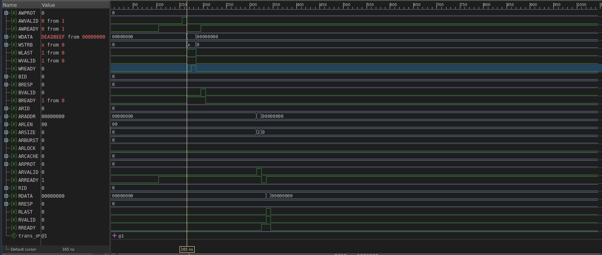
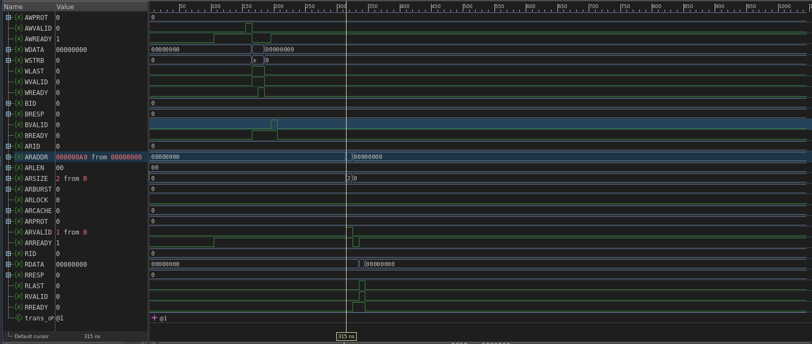

# Srodowisko Testowe AXI4 Command-Driven

System pozwala na sterowanie symulacja za pomoca prostych skryptow tekstowych, co eliminuje koniecznosc edycji kodu SystemVerilog przy kazdej zmianie scenariusza testowego.

## Skladnia Microsemi
W oryginalnym rozwiazaniu Microsemi DirectCore, testy definiuje sie w plikach tekstowych uzywajac skladni:
- write w <resource> <address> <data>
- readcheck w <resource> <address> <expected_data>

Niniejszy projekt przenosi te idee do srodowiska Aldec, oferujac nastepujaca skladnie w folderze scripts/:

- WRITE [adres_hex] [dane_hex] - Wykonuje transakcje zapisu AXI4.
- READ [adres_hex] - Wykonuje transakcje odczytu AXI4.
- WAIT [liczba_cykli] - Wstrzymuje interpreter o zadana liczbe taktow zegara.
- # - Komentarz (linia ignorowana).

### Przykladowy plik testowy (test_v1.txt):
# Prosty test zapisu i odczytu pamieci
WRITE 000000A0 DEADBEEF
WAIT 10
READ 000000A0
WAIT 20

## Weryfikacja i Wyniki (Waveforms)

### 1. Operacja Zapisu (WRITE)
Po komendzie WRITE, Master BFM generuje transakcje na szynie. Widoczny poprawny handshake kanalow adresowych i danych.

### 2. Operacja Odczytu (READ)
Dzieki pamieci zaimplementowanej w Slave BFM (tb_top.sv), odczyt adresu 0xA0 zwraca poprawnie wartosc 0xDEADBEEF zapisaną wczesniej.

## Wymagania Systemowe
Do uruchomienia projektu niezbedne sa:
1. Pliki IP Aldec BFM: Musza znalezc sie w folderze aldec_bfm/.
2. Biblioteki PLI: Pliki libaldecpli.so oraz libAxiBfmPliRiv.so (znajduja sie w folderze bin/Linux64 instalacji symulatora).
3. Symulator: Aldec Riviera-PRO.

## Instrukcja Uruchomienia

1. Otworz konsole w symulatorze i przejdz do folderu:
   cd sim
2. Skompiluj projekt (automatyczna konfiguracja flag):
   do compile.do
3. Uruchom symulacje i wyswietl wykresy:
   do run.do

Symulacja zatrzyma sie automatycznie po wykonaniu skryptu ($stop), umozliwiajac analize przebiegow.